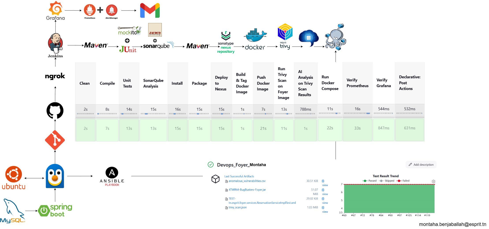

# **Dormitory Management Application** 🏢

## 📋 Overview
The **Dormitory Management Application** is a Spring Boot-based solution designed to streamline dormitory operations, such as managing rooms, reservations, and student allocations. This project showcases a modern **DevOps pipeline**, integrating CI/CD, containerization, and monitoring to ensure a robust and scalable application.

Built with **Spring Boot** and **MySQL**, the app leverages tools like **Jenkins**, **Docker**, **SonarQube**, and **Grafana** to automate the development lifecycle, from code quality checks to deployment and monitoring.

<br>

## 🔹 Key Features
- **Room Management:** Add, update, and delete dormitory rooms with details like capacity and availability.  
- **Reservation System:** Manage student reservations and room assignments.  
- **User Authentication:** Secure access for admins and students using Spring Security.  
- **Automated CI/CD Pipeline:** Build, test, and deploy the app with Jenkins and Docker.  
- **Code Quality & Security:** Analyze code with SonarQube and scan Docker images with Trivy.  
- **Monitoring:** Track app performance with Prometheus and Grafana.

<br>

## 🛠️ DevOps Pipeline Architecture
Below is the architecture of the DevOps pipeline implemented for this project:



### **Pipeline Stages:**
- **Clean & Compile:** Use Maven to clean and compile the code.  
- **Unit Tests:** Run JUnit tests to ensure code reliability.  
- **SonarQube Analysis:** Perform static code analysis for quality and security.  
- **Build & Package:** Package the app into a JAR file and deploy it to Nexus.  
- **Docker Image:** Build and push a Docker image to Docker Hub.  
- **Security Scan:** Scan the Docker image with Trivy for vulnerabilities.  
- **Deployment:** Deploy the app using Docker Compose.  
- **Monitoring:** Use Prometheus and Grafana to monitor app performance in real-time.

### **Tools Used:**
- **Jenkins:** CI/CD automation.  
- **Maven & JUnit:** Build and test automation.  
- **SonarQube:** Code quality analysis.  
- **Nexus:** Artifact repository.  
- **Docker & Trivy:** Containerization and security scanning.  
- **Prometheus & Grafana:** Monitoring and observability.  
- **Ansible Playbook:** Configuration management .

<br>

## 📋 Prerequisites
Before running the project, ensure you have the following installed:  
- **Java 17**  
- **Maven 3.8.1+**  
- **Docker** and **Docker Compose**  
- **MySQL** (for the database)  
- **Jenkins** (for CI/CD pipeline)  
- **Internet Access** (for SonarQube, Nexus, and Docker Hub)

<br>

## 🗂️ Project Structure
foyer/<br>
├── src/<br>
│   ├── main/<br>
│   │   ├── java/<br>
│   │   │   └── com/dormitory/management/<br>
│   │   │       ├── controller/<br>
│   │   │       │   └── ReservationController.java<br>
│   │   │       ├── entity/<br>
│   │   │       │   ├── Room.java<br>
│   │   │       │   └── Reservation.java<br>
│   │   │       ├── repository/<br>
│   │   │       │   ├── RoomRepository.java<br>
│   │   │       │   └── ReservationRepository.java<br>
│   │   │       ├── service/<br>
│   │   │       │   ├── RoomService.java<br>
│   │   │       │   └── ReservationService.java<br>
│   │   │       └── foyerApplication.java<br>
│   │   └── resources/<br>
│   │       └── application.properties<br>
│   └── test/<br>
├── Dockerfile<br>
├── docker-compose.yml<br>
├── Jenkinsfile<br>
├── pom.xml<br>
└── README.md<br>

<br>

## ⚙️ Setup Instructions

### **1. Clone the Repository**
```bash
git clone https://github.com/MontahaJaballah/DevOps-Dormitory-Management-Application.git
cd dormitory-management
````
<br>
📈 Monitoring & Observability<br>
Prometheus scrapes metrics from the app (e.g., HTTP requests, JVM stats).<br>
Grafana visualizes these metrics in real-time dashboards.<br>
Example metrics: Request latency, error rates, and resource usage.<br>
<br>
🔒 Security Practices<br>
SonarQube: Identifies code vulnerabilities and ensures best practices.<br>
Trivy: Scans Docker images for known vulnerabilities before deployment.<br>
Implement Ansible for automated infrastructure provisioning.<br>
<br>
🚀 Future Improvements<br>
Deploy the app to a cloud platform like AWS or Kubernetes.<br>
Add more advanced monitoring with ELK Stack for logs.<br>


<br>
📬 Connect with Me<br>
Feel free to reach out on LinkedIn to discuss DevOps, Spring Boot, or tech in general! Let’s learn and grow together. 😄<br>

#DevOps #SpringBoot #CI/CD #Docker #Jenkins #SonarQube #Prometheus #Grafana
